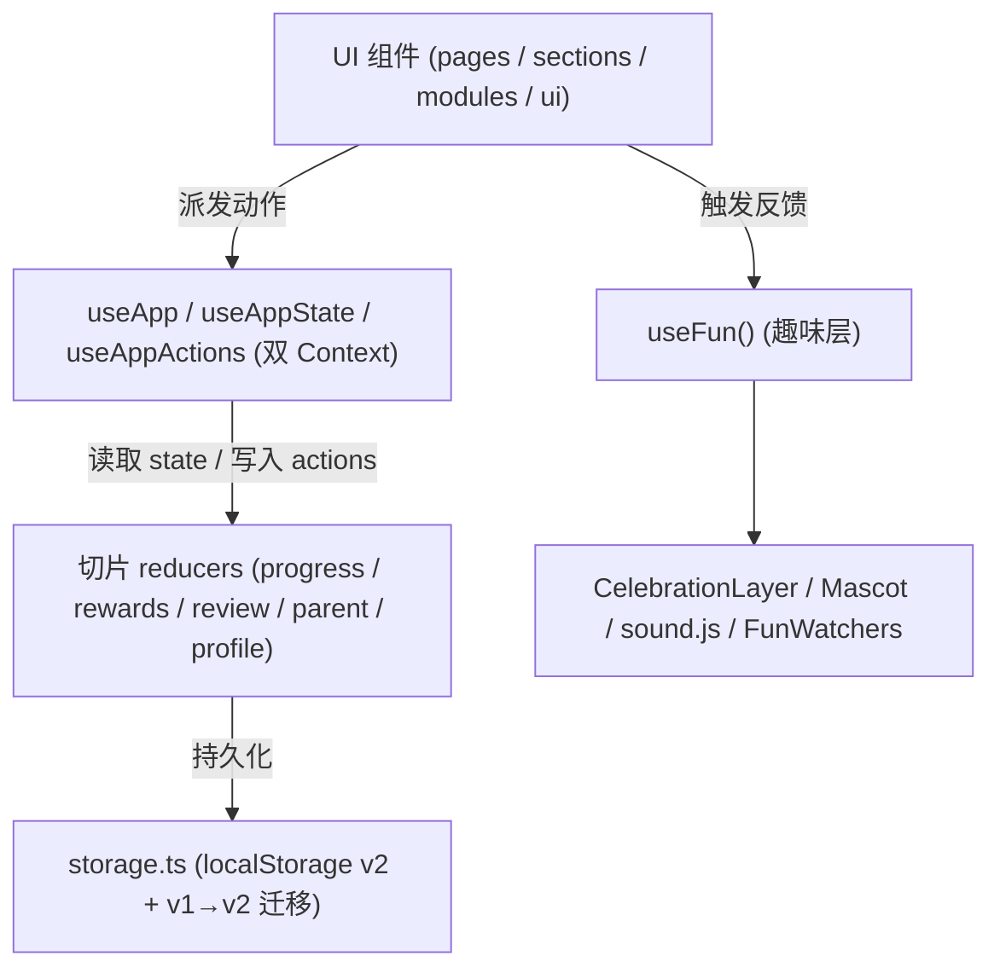

# 快乐学园 · 小学生在线学习平台前端

> 一个面向小学生的在线学习网站前端：覆盖**年级分层学习、互动答题、趣味动画视频、游戏化激励、学习进度跟踪、家长查看（含周报）、错题 SRS 复习、每日打卡、奖励商店、课文朗读背诵打卡、未成年夜间锁、档案导入导出**，并内置一层「庆祝动效 / 音效 / 吉祥物 / 彩蛋」的趣味层。界面明亮、操作简洁，完整支持桌面端与移动端响应式体验。

项目由设计稿（Ardot）落地为可运行的前端工程，技术栈为 **React 18 + Vite 5 + CSS Modules**；状态层已 **TypeScript 化并按领域切片为多个 reducer**，路由采用 **React.lazy 按需懒加载**，并配有多道机器化质量门禁（ESLint / `tsc` 类型检查 / 设计令牌门禁 / Vitest 单元测试）。

---

## ✨ 功能特性

| 模块 | 说明 | 主要落点 |
| --- | --- | --- |
| 年级分层学习 | 按年级组织知识点与答题进度，各年级进度独立追踪 | `GradeLearning` / `GradeKnowledge`、`quizByGrade` |
| 互动练习 / 答题引擎 | 逐题判分、对错动画反馈、自动建错题本 | `ExerciseEngine` |
| 趣味动画视频 | 视频卡片（缩略图 / 播放 / 时长徽章）+ 播放弹窗模拟进度与计分 | `VideoLibrary` / `VideoModal` |
| 游戏化激励 | 积分 / 徽章 / 等级成长体系，升级与解锁均有反馈 | `Gamification`、`derived.level` |
| 学习进度跟踪 | 本周学习时长、三科掌握度可视化 | `ProgressTracking` / `SubjectMastery` |
| 家长查看面板 | 孩子档案、今日动态、护眼与时长管理开关（实时切换） | `ParentPanel` |
| 家长周报 | 聚合近 7 天学习活动，生成可复制分享的周小结 | `ParentWeeklyReport` |
| 错题复习中心（SRS） | 间隔重复复习计划，答对即移出错题本 | `WrongQuestionCenter`、`reviewSchedule` |
| 每日打卡 | 连续学习天数记录与打卡激励 | `DailyCheckIn`、`streakDays` |
| 奖励商店 | 用积分兑换虚拟 / 实物奖励 | `RewardStore`、`REDEEM_REWARD` |
| 课文朗读背诵打卡 | 课文朗读 / 背诵打卡状态记录 | `TextbookPage`、`textRead` / `textRecite` |
| 未成年夜间锁 | 22:00–6:00 禁止进入学习界面，家长密码可临时放行 | `MinorModeGate` |
| 档案导入导出 | 进度备份导出为文件，或导入到其他设备继续 | `profileIO.js`、`ParentPanel` 档案弹窗 |
| 趣味层 | 庆祝动效、音效、悬浮吉祥物、彩蛋（详见下节） | `components/fun/*` |

> 以上功能均已上线；答题、视频观看、打卡、奖励兑换、SRS、未成年锁等核心链路在 `npm test`、`npm run build`、`npm run typecheck` 全绿的前提下持续可用。

---

## 🎉 趣味层（Fun Layer）

应用根部（`src/main.jsx`：`AppProvider` → `FunProvider` → `App`）挂载一层轻量「趣味层」，对外只暴露一个 `useFun()` Hook，业务组件保持干净、核心 reducer 不被触碰。

- **`FunProvider` / `useFun()`**（`src/components/fun/FunContext.jsx`）：统一的庆祝与反馈 API——`celebrate({ title, icon, confetti, tone })` 吐司提示、`sound(type)` 音效、`setMood(mood, duration)` 驱动吉祥物、`unlockSecret()`。返回 `{ celebrate, sound, setMood, mood, secretUnlocked, unlockSecret }`。
- **`CelebrationLayer`**（`src/components/fun/CelebrationLayer.jsx`）：固定全屏、非阻塞吐司 + 纯 CSS 礼花，在 `prefers-reduced-motion` 下自动关闭。
- **`Mascot`**（「星宝」，右下角）：轻柔漂浮，随情绪切换表情与气泡；连续快速点击解锁神秘徽章。
- **`FunWatchers`**（`src/components/fun/FunWatchers.jsx`）：纯副作用监听，在升级、新徽章解锁、连击达标时触发庆祝 + 音效，不改动应用状态。
- **音效**（`src/utils/sound.js`）：原生 Web Audio API（无第三方库），内置 `correct / wrong / ding / fanfare / levelup / egg` 配方；尊重家长音效开关，无音频环境静默失败。
- **彩蛋**：连点吉祥物若干次 → 神秘探索者徽章 + 礼花；短时间内连点顶部 Logo 多次 → 礼花爆发。
- **`AchievementWall`**（`src/components/sections/AchievementWall.jsx`）：勋章墙，解锁秘密后追加 `SECRET_BADGE`。
- **趣味文案**集中在 `src/data/fun.js`（`PRAISE`、`ENCOURAGE`、`LEVEL_UP`、`BADGE_UNLOCK`、`EGG_MESSAGES`、`MASCOT_LINES`）。

> 图标红线（P0）：所有功能图标统一走 `src/components/ui/Icon.jsx` 的内联 SVG 图标库（名字为联合类型，编译期校验），**严禁用 emoji 充当功能图标**；课程数据（如 `MATCH_WORDS` 的 emoji↔词语）属教学内容，已在 ESLint 中对 `src/data/**/*.js` 豁免。

---

## 🛠 技术栈

| 类别 | 选型 |
| --- | --- |
| 框架 | React 18（纯函数组件 + Hooks） |
| 构建工具 | Vite 5 |
| 样式方案 | CSS Modules（组件级作用域）+ 全局设计令牌（`:root` CSS 变量） |
| 状态管理 | React Context + `useReducer`，**状态层已 TypeScript 化并切片为多个领域 reducer** |
| 路由 | React Router 6，**页面级 `React.lazy` 懒加载**（`<Suspense>` 包裹） |
| 语言 | `src/state/**` 与类型定义用 **TypeScript**；UI 组件为 JSX（迁移期） |
| 测试 | **Vitest** 单元测试（`npm test`） |
| 图标 | 全内联 SVG（`Icon` 组件），零 emoji / Unicode 功能图标 |
| 字体 | Fredoka（标题）/ Quicksand（正文） |

### 质量门禁（CI / 提交前）

| 门禁 | 命令 | 说明 |
| --- | --- | --- |
| Lint | `npm run lint`（`eslint .`） | 全量源码静态检查；`src` 真实错误须为 0 |
| 类型检查 | `npm run typecheck`（`tsc --noEmit`） | 状态层与类型定义强类型校验 |
| 设计令牌门禁 | `scripts/check-design-tokens.sh` | 机器化拦截硬编码色值与超大分包体积；emoji 图标门禁由 ESLint 承担 |
| 单元测试 | `npm test`（`vitest run`） | `src/state/__tests__` 下覆盖 storage 迁移 / SRS / 进度 / 工具等 |

---

## 🧱 架构概览



---

## 📁 数据层

数据按「首屏必需」与「按需加载」分离，避免年级数据拖慢首屏：

- **`src/data/content.js`**：首屏学科、题库、视频、奖励、文案等核心数据 + 纯函数工具（数据 / 视图分离）。
- **`src/data/grade.js`**：年级知识点数据，**按需加载**（仅在「年级」路由被访问时才进入独立 chunk，不进首屏包）。
- 其它：`fun.js`（趣味文案）、`site.js`（站点 / 导航配置）、`subjects.js`、`textbook.js`。

---

## 🧩 状态管理

全局状态由 `src/state/` 统一管理，采用 **Context + useReducer** 的单向数据流，且状态层已 **TypeScript 化并切片为多个 reducer**：

- **`src/state/AppContext.jsx`**：拆为 **state / actions 双 context**，对外暴露 `useApp()`（含 `{ state, derived, actions }`），以及渐进可用的 `useAppState()` / `useAppActions()`；组件只通过 `actions` 派发意图，不直接改 `state`。
- **`src/state/reducers/`**：按领域切片的 reducer —— `progress.ts`、`rewards.ts`、`review.ts`、`parent.ts`、`profile.ts`；`reducer.ts` 组合各切片；派生数据集中在 `selectors.ts` 由 `useMemo` 计算。
- **`src/state/types.ts`**：全部状态 / 动作 / 值类型定义（如 `AppState`、`AppAction`、`WrongMap`、`ReviewSlot`）。
- **`src/state/storage.ts`**：读写 `localStorage`（键 `happy-learning-state-v2`，兼容旧 `v1` 自动迁移）；`loadState` 对数值强转、缺失字段回退默认、解析异常整体回退，**绝不抛错白屏**。

### 派生数据（derived，组件直接取用）

`level` / `levelTitle`（等级与称号）、`nextLevelPoints` / `levelProgress`（升级进度）、`badges` / `unlockedCount`（徽章墙）、`mastery`（三科掌握度百分比）、`wrongCountBySubject`（各科错题数）、`todayStudyMin` / `dailyLimitMin` / `dailyRemainingMin` / `dailyOverLimit`（今日屏幕时间）。

### 边界场景与处理

- **存储损坏 / 旧版本**：`migrate` 强制转数字、缺失字段回退默认，异常整体回退默认状态。
- **重复计分**：课程 / 视频完成均做幂等保护，重复点击不再加分。
- **跨天归零**：`todayStudySec` 按本地自然日归零，家长每日上限按「天」生效。
- **连续打卡**：今天已记过不重复 +1；昨天活跃 +1；更早断签重置为 1（用本地日期，避免 UTC 凌晨错算）。
- **错题本自清理**：SRS 复习答对即移出错题本，改对即清。
- **答题防呆**：`safeInt` 把 `undefined`/负数/NaN 收敛为安全值；未答完不允许提交。

---

## 🚀 快速开始

### 环境要求

- Node.js ≥ 18
- npm ≥ 9

### 安装与运行

```bash
# 安装依赖
npm install

# 启动开发服务器（默认 http://localhost:5173/）
npm run dev

# 生产构建，输出到 dist/
npm run build

# 本地预览生产构建产物
npm run preview

# 静态检查（ESLint，全量源码）
npm run lint

# 类型检查（tsc --noEmit）
npm run typecheck

# 单元测试（Vitest）
npm test
```

### 设计令牌门禁（CI / 提交前）

```bash
# 拦截硬编码色值与超大分包体积
bash scripts/check-design-tokens.sh
```

---

## 📂 项目结构（精要）

```
happy-learning/
├─ index.html                 # HTML 入口
├─ vite.config.js             # Vite 配置（React 插件 + 构建）
├─ eslint.config.js           # ESLint 9 Flat Config（含 P0 emoji 门禁 / data 豁免）
├─ scripts/
│  ├─ check-design-tokens.sh  # 设计令牌门禁（硬编码色 + 分包体积）
│  └─ ssr-check.mjs           # 无浏览器渲染冒烟测试（捕获首屏崩溃）
├─ docs/
│  └─ EXAMPLES.md             # 组件 / 状态使用与扩展示例
├─ public/
│  └─ star.svg                # 吉祥物 / 品牌图标资源
├─ src/
│  ├─ main.jsx                # React 渲染入口（AppProvider → FunProvider → App）
│  ├─ App.jsx                 # 路由装配：页面级 React.lazy + <Suspense>
│  ├─ index.css               # 全局设计令牌（:root CSS 变量）
│  ├─ data/
│  │  ├─ content.js           # 首屏核心数据 + 纯函数工具
│  │  ├─ grade.js             # 年级数据（按需加载，不进首屏）
│  │  ├─ fun.js / site.js / subjects.js / textbook.js
│  ├─ state/
│  │  ├─ AppContext.jsx       # 双 context（state/actions）+ useApp/useAppState/useAppActions
│  │  ├─ types.ts / storage.ts / selectors.ts / constants.ts / helpers.ts / reducer.ts
│  │  ├─ reducers/            # progress / rewards / review / parent / profile 切片 reducer
│  │  ├─ profileIO.js         # 档案导入 / 导出
│  │  └─ __tests__/           # Vitest 单测（storage / review / progress / helpers）
│  ├─ utils/
│  │  └─ sound.js             # Web Audio API 音效（无第三方库）
│  └─ components/
│     ├─ ExerciseEngine.jsx   # 答题引擎（逐题判分 + 错题本）
│     ├─ VideoModal.jsx       # 视频播放弹窗（模拟进度 + 观看计分）
│     ├─ fun/                 # 趣味层（FunContext / FunWatchers / CelebrationLayer / Mascot）
│     ├─ ui/                  # 可复用 UI 原语（Icon / Button / ProgressBar / Pill / SectionHeading ...）
│     ├─ sections/            # 首页业务区块（Header / Hero / ParentPanel / Footer / AchievementWall ...）
│     ├─ modules/             # 复用模块（GradeLearning / DailyCheckIn / ParentWeeklyReport / RewardStore / WrongQuestionCenter / GameCenter / SubjectMastery ...）
│     └─ pages/               # 路由级页面（Home / LearnCenter / ReviewCenter / GrowthCenter / GradeLearning / PlayCenter / ParentCenter / VideoLibrary / TextbookPage / SubjectPage），均 React.lazy
```

---

## 🎨 设计系统

设计令牌集中在 `src/index.css` 的 `:root` 变量，与原始设计稿保持一致，便于统一调整主题。

### 配色

| 用途 | 颜色 | 值 |
| --- | --- | --- |
| 主色（蓝） | Primary | `#4D96FF` |
| 语文（粉） | Chinese | `#FF6B9D` |
| 英语 / 进度（绿） | English | `#3DCA6E` |
| 数学 / 强调（橙） | Math | `#FF9F45` |
| 游戏化（紫） | Game | `#7A5CFF` |
| 背景暖白 | Bg | `#FFF8F0` |

### 圆角与阴影

- 卡片圆角：`--radius-card: 24px`
- 按钮圆角：`--radius-btn: 999px`
- 阴影：`--shadow-soft` / `--shadow-card` 两级柔和投影

### 字体

- 标题：`Fredoka`（圆润活泼）
- 正文：`Quicksand`（清晰友好）

> 在本地未安装字体时，浏览器会回退到系统无衬线字体；上线时建议通过 `@font-face` 或字体 CDN 引入。

---

## ♿ 可访问性

- 语义化标签（`<header>` / `<main>` / `<section>` / `<footer>` / `<nav>`）
- 关键交互元素添加 `aria-label` 与 `role`（如弹窗 `role="dialog"` `aria-modal`）
- 弹窗支持 **Esc 键关闭**（文档级监听，避免在非交互元素上挂 JSX 事件处理器）
- `:focus-visible` 焦点环，键盘可达
- `prefers-reduced-motion` 下自动降级动画
- 色块统一走 `currentColor` 与 `color-mix`，便于主题化
- 工程上以 ESLint `jsx-a11y` 规则守住以上约定（本次清理了全部 a11y 真实告警）

---

## 📦 构建产物

`npm run build` 输出到 `dist/`，为静态资源，可部署到任意静态托管（如 Nginx、GitHub Pages、EdgeOne Pages 等）。构建产物按路由拆分为多个 chunk（含 `grade-*.js` 等按需加载块）。

---

## 📄 开源协议

本项目基于 [MIT License](./LICENSE) 开源。详见 `LICENSE` 文件。
