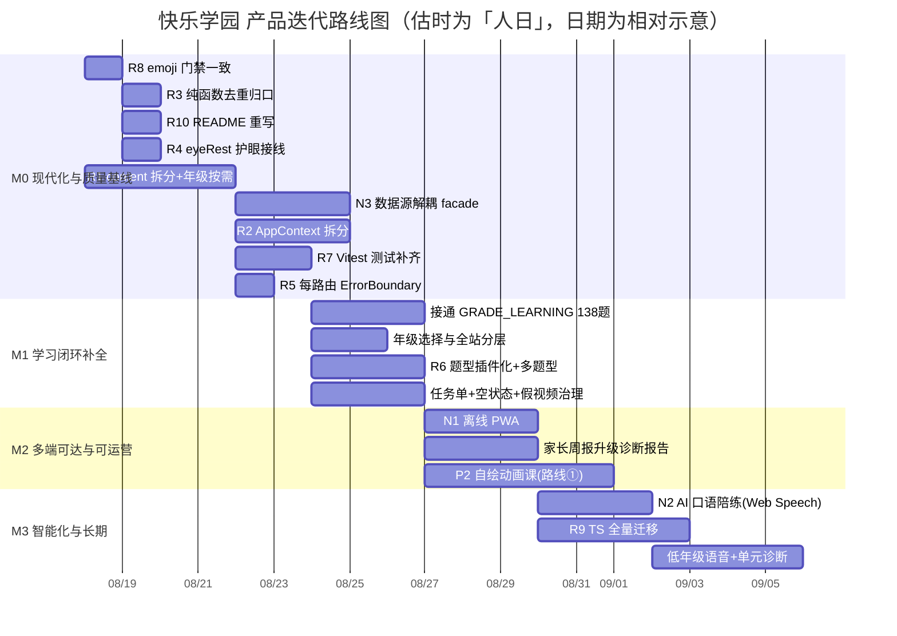

# 快乐学园（happy-learning）· 产品迭代路线图

> 作者：许清楚（产品经理） ｜ 日期：2026-08-13 ｜ 视角：产品 / 交付价值
> 输入基线：架构师 `PROJECT-ANALYSIS.md`（技术剖析）、`REFACTOR-AND-NEW-MODULES.md`（重构+新模块）
> 对齐文档：`prd-product-research.md`（产品调研/内容路线图）、`IMPROVEMENT-PLAN.md`（三文档整合方案）
> 原则：产品语言为主；验收标准一律"可量化、可验证"；已交付功能不再当新功能。

---

## 一、产品现状与定位（简）

**一句话定位**：对齐课标的每日 15 分钟——孩子自己愿意练，家长一页看懂"哪里不会、今晚怎么陪"。**不注册、不上传、无广告、无内购、无销售电话**（小学 1–6 年级，纯前端 + localStorage 单用户）。

**当前成熟度（已交付，非新功能）**：年级分层学习、错题复习中心（SRS 间隔重复）、家长周报、每日打卡、奖励商店、课文朗读背诵打卡、未成年夜间锁、档案导入/导出、状态层 TypeScript 化、路由懒加载、设计令牌门禁、全应用错误边界。代码实测 69 个源文件，核心学习闭环已成形——**项目成熟度高于 README 与团队初判**，属"闭环可用、但未优化、部分承诺未兑现"的中高成熟度。

**核心用户价值**：① 课标同步 × 1–6 年级 × 三科的轻量自学工具（竞品结构空白）；② 零账号零上传的隐私可信度（把技术约束变营销主张）；③ 家长要"诊断"不要"时长"（错题本+SRS+掌握度翻译成"薄弱点+怎么陪"）。

**3 个最重要的待补缺口（从架构师薄弱环节提炼为产品语言）**：

| # | 缺口（产品语言） | 来源（架构师证据） | 为什么重要 |
|---|---|---|---|
| G1 | **首屏/弱网体验差**：手机打开会转圈，年级数据跟着首屏一起下载 | 首屏 JS ≈ 323KB（index 50.8 + react-vendor 163 + content 110），年级数据未真正按需（§3.2） | 直接拖累"次日打开率"——这是本项目"行业一流"的首要判据 |
| G2 | **闭环"假性完整"、内容倒挂**：最优质的 138 道题在闭环外空转，主学习流无年级维度，视频是假的 | GRADE_LEARNING 138 题只读、SubjectPage 无年级、VIDEOS 无 src（PRD §一） | 家长仍答不了"哪里不会、怎么陪"，差异化落不了地 |
| G3 | **质量可信度与合规缺口**：随时可能被回归破坏、护眼承诺未兑现、对外表述失真 | 零测试（§2.5）、eyeRest 未接线（§3.1）、emoji 门禁冲突、README 严重过时（§1.6） | "已交付"不可信；不合规则不可称护眼；文档误导新成员/用户 |

> 路线图的排序逻辑：**先补 G3（可信基线）→ 再补 G2（接电/分层，交付核心差异化）→ 铺 G1 衍生体验（多端/离线）→ 长期智能化**。M0 解决 G3，M1 解决 G2，M2 解决多端可达，M3 智能化。

---

## 二、分阶段产品迭代路线图

### 阶段划分说明

对齐架构师 Phase 0–3，按**产品价值与 ROI** 重新命名为 4 个里程碑（M0–M3）。**立即启动的下一阶段为 M0「现代化与质量基线」**——它是 M1「接电」的前置安全网与数据底座（详见第三节论证）。

| 里程碑 | 阶段目标（产品语言） | 对齐架构师 | 解决的核心缺口 |
|---|---|---|---|
| **M0 现代化与质量基线** | 把"已交付的闭环"锁成可信赖、可维护、合规的基线：首屏减负、高频交互不掉帧、回归有网、护眼承诺兑现、文档说真话 | Phase 0（质量止血）+ Phase 1（架构/性能） | G3 |
| **M1 学习闭环补全** | 接通 138 题入闭环 + 全站年级分层 + 多题型引擎 + 任务单/空状态/假视频治理——交付核心差异化"诊断" | 内容路线图 P0 + R6 + N3 协同 | G2 |
| **M2 多端可达与可运营** | 离线可装到桌面、内容可运营（远程源）、家长周报升级诊断报告、真实动画课 | N1 + 内容 P1/P2 路线① | G1 衍生 + 诊断升级 |
| **M3 智能化与长期** | AI 口语陪练（自评占位）、组件层全量 TS 化、低年级语音、单元诊断卷 | N2 + R9 + 内容 P1 | 长期护城河 |

### M0 · 现代化与质量基线（下一阶段，重点）

**阶段目标**：以最小风险把现有功能升级为"高性能 + 零回归 + 合规 + 文档真实"的可信赖基线，为 M1 内容"接电"铺数据层与测试网。

| 关键特性/改进 | 优先级 | 对应方案 | 用户/产品收益 |
|---|---|---|---|
| content.js 拆分 + 年级数据按需加载 | **P0** | R1 | 首屏更快（弱网不转圈）；为 540 题扩展与年级分层铺数据底座 |
| AppContext 拆分（状态/动作分离） | **P0** | R2 | 答题/游戏更跟手，高频交互不掉帧（命中差评"崩溃/卡顿"） |
| 每路由 ErrorBoundary 隔离 | P1 | R5 | 单页 chunk 失败模块级兜底，不拖垮全局（命中差评"进度丢失"） |
| Vitest 测试补齐（纯函数） | P1 | R7 | 已交付闭环不被回归破坏；M1 接电的安全网 |
| eyeRest 护眼提醒接线 | P1 | R4 | 按《未保条例》兑现护眼承诺；"行业一流"底线 |
| emoji 门禁一致性（MATCH_WORDS→Icon） | P1 | R8 | 视觉统一 + 通过 P0 门禁；维护"零 emoji 功能图标"品牌 |
| 纯函数去重归口（TYPE_ICON/日期/REWARD） | P1 | R3 | 行为一致，降低隐藏 bug 与回归风险 |
| README 重写对齐现状 | P2 | R10 | 对外表述准确，降低新成员/用户误导 |
| 内容数据源解耦 facade（协同 R1） | P1 | N3 | 数据从"静态块"升级为可运营资产，调用方零改，M1 零改动接入 |

**阶段出口可量化验收标准（详见第三节，此处为阶段总览）**：首屏关键 JS 下降 ≥90KB 且年级数据不进首屏；核心纯函数单测覆盖 ≥80% 且 CI 常态化；高频交互无关组件重渲染归零；eyeRest 默认开启且合规 + P0 emoji 门禁 CI 全绿；README 对齐并 review 通过；9 路由独立错误边界；首屏 LCP/TTI 达标（4G）；数据 facade 就绪。

### M1 · 学习闭环补全

**阶段目标**：把"最好的内容接上电"——让家长真正看到"哪里不会、怎么陪"，交付产品核心差异化。

| 关键特性/改进 | 优先级 | 对应方案 | 用户/产品收益 |
|---|---|---|---|
| 接通 GRADE_LEARNING 138 题入闭环（错题本/掌握度/积分/周报） | **P0** | PRD P0#3 | 题库 0 成本 36→174；最优质题不再空转 |
| 年级选择与全站分层（profile 存年级，不进 URL） | **P0** | PRD P0#2 | 一年级不再撞六年级题；分龄内容（合规） |
| 多题型引擎（插件化骨架 + 7 型） | **P0** | R6 | 识字/计算/笔顺不被"全单选"失真 |
| 每日学习任务单（今日三件事） | P0 | PRD P0#5 | 替代"自己找入口"，提升次日打开率 |
| 空状态与首次引导（8 处） | P0 | PRD P0#8 | 新用户不面对空白页 |
| 假视频降级治理（脚本卡 + 官方外链） | P0 | PRD P0#1 | 诚信红线，拔除假播放进度条 |
| 错题记录四溯源字段（grade/point/type/level）前置 | **P0** | PRD 数据契约 | 为 P2 诊断报告零返工 |

**阶段出口可量化验收标准**：
- 题库入闭环题量：36 → ≥174（接通 138 道年级题）；错题记录 100% 携带 grade/point/type/level 四字段（CI 断言 + 抽样核对）。
- 年级分层：选三年级后语文学科页只呈现三年级知识点（自动化/E2E 校验 1–6 年级各自内容范围，0 越级）。
- 题型：答题引擎支持 ≥3 型自动判分（单选/填空/连线），错题本/积分逻辑与单选一致（回归用例通过）。
- 任务单：新用户首屏 100% 呈现"今日三件事"，完成态可一键进入各项（走查 + 状态校验）。
- 假视频：视频库 0 条出现自动推进播放条；有官方外链条目 100% 可跳转（内容审计）。

### M2 · 多端可达与可运营

**阶段目标**：让产品"装得上桌面、断得开网"，并把内容从代码块升级为可运营资产；家长周报升级为诊断报告。

| 关键特性/改进 | 优先级 | 对应方案 | 用户/产品收益 |
|---|---|---|---|
| 离线优先 PWA（Manifest + SW 缓存） | P1 | N1 | 家长在意"不联网不耗流量"；弱网/离线可复习 |
| 内容数据源解耦（远程模式可选） | P1 | N3 | 内容可运营/CMS 化，前端零改 |
| 家长周报升级诊断报告（3 薄弱点+3 动作，可打印/导出图） | P1 | PRD P1#9 | 直面"他哪里不会、我怎么讲" |
| 真实动画课（自绘 SVG/CSS，路线①） | P2 | PRD P2#1 | 补视频空白，零版权零带宽 |

**阶段出口可量化验收标准**：
- PWA：Lighthouse PWA 评分 ≥ 90；离线（断网）下已访问路由 100% 可打开且答题/记录可用；可安装提示正常。
- 诊断报告：家长空间一屏内可列出"本周 3 个薄弱知识点 + 3 条今晚 5 分钟陪学动作"；可导出图片/打印（走查 + 导出产物校验）。
- 动画课：≥3 个高频难点知识点具备自绘动画课（分镜脚本 + 配套练习），无占位假播放。

### M3 · 智能化与长期

**阶段目标**：补齐语音能力、组件层类型安全，预留 AI 口语闭环，深化诊断。

| 关键特性/改进 | 优先级 | 对应方案 | 用户/产品收益 |
|---|---|---|---|
| AI 口语陪练（Web Speech 自评 + 录音回放，预留后端 seam） | P2 | N2 | 填补英语"开口说"缺口（诚实自评，不假装 AI 打分） |
| 组件层全量 TS 化（棘轮） | P2 | R9 | 组件层类型安全，减少运行期 bug |
| 低年级语音支持（题干朗读 + 拼音标注） | P2 | PRD P1#10 | 1–2 年级能否自主使用的生死线 |
| 单元诊断卷 + 学期报告 | P2 | PRD P1#11 | 错因分类直供家长周报 |

**阶段出口可量化验收标准**：
- AI 口语：Web Speech 能力检测通过的设备 100% 可跑通"示范→跟读→识别→反馈"闭环；录音不落 localStorage（合规）；后端评分 seam 接口预留。
- TS 化：组件层 `.jsx` 比例降至 0（或仅逃逸点带 `@ts-expect-error`）；`tsc --noEmit` 覆盖全仓（`strict` 档）。
- 语音：1–2 年级英语/语文题干 100% 可朗读 + 拼音标注（走查 + 能力检测）。

### 路线图时间线（Mermaid）

> 排期粗估：M0 ≈ 8–11 人日（架构师 Phase0 2–3 + Phase1 6–8）；M1 ≈ 11–13 人日；M2 ≈ 11–13 人日；M3 ≈ 11–15 人日。合计约 41–52 人日（≈ 2 个工程师 5–6 周）。

---

## 三、下一阶段详细规划（M0 · 现代化与质量基线，重点）

### 为何 M0+M1 合并的"现代化与质量基线"立即启动、ROI 最高

1. **数据是 M1「接电」的前置**：540 题 / 年级分层要"首屏不炸"，必须先有 R1 数据拆分 + N3 facade；否则 138 题接电会重演"全量拉数据"的退化。
2. **安全网是 M1 接电的前置**：M1 改动 ExerciseEngine / 错题本 / 掌握度，若无 R7 测试 + R5 错误边界，回归风险高，已交付闭环可能被破坏。
3. **合规与信任是差异化底线**：eyeRest 不接线则不可称护眼；emoji 门禁冲突则 CI 不健康；README 失真则对外失信——这些不修，M1 的价值也站不稳。
4. **ROI 实证**：R1+R2 直接换回首屏 −100KB 与高频交互不掉帧（命中差评第 5 类"崩溃/卡顿"），单轮约 1.5–2 周，收益贯穿所有后续阶段。

### 开发目标（5 条，清晰可衡量）

1. **首屏减负**：首屏关键 JS 体积下降 ≥ 90KB（content 年级数据移出首屏），首屏 TTI ≤ 3s（4G 模拟）。
2. **回归安全网**：核心纯函数单测覆盖 ≥ 80%，CI 常态化（typecheck / lint / format / test / build / 门禁全绿）。
3. **高频交互零多余重渲染**：答题/游戏场景下非状态消费组件 commit 数归零。
4. **合规与门禁零冲突**：eyeRest 护眼提醒默认开启且按《未保条例》生效；P0 emoji 门禁 CI 全绿；9 路由独立错误边界。
5. **文档与数据底座就绪**：README 对齐现状并 review 通过；内容数据 facade 落地、调用方零改，为 M1「接电」与 540 题扩展铺平。

### 关键特性清单（逐条，含 R 编号 + 用户/产品收益）

| 项 | R 编号 | 用户收益 | 产品收益 |
|---|---|---|---|
| content.js 拆分 + 年级数据按需 | R1 | 手机弱网打开不转圈；年级页加载更快 | 首屏−100KB；为 540 题/年级分层铺数据底座 |
| AppContext 状态/动作分离 | R2 | 答题、游戏更跟手，不掉帧 | 命中差评"卡顿/崩溃"；为大数据量铺路 |
| 每路由 ErrorBoundary 隔离 | R5 | 单页出错只影响该页，模块级友好兜底 | 命中差评"进度丢失"；懒加载后必配 |
| Vitest 纯函数测试补齐 | R7 | 间接：已交付闭环不被回归破坏 | M1 接电变更的安全网；回归风险↓ |
| eyeRest 护眼提醒接线 | R4 | 连续用眼 30 分钟弹提醒，回应"久坐伤眼" | 合规红线；"行业一流"底线；开关名副其实 |
| emoji 门禁一致性 | R8 | 视觉统一（图标替代 emoji） | 通过 P0 门禁；维护"零 emoji"品牌 |
| 纯函数去重归口 | R3 | 间接：积分/打卡/徽章行为一致 | DRY；降低隐藏 bug |
| README 重写对齐 | R10 | 间接：新成员/用户看懂真实功能 | 对外表述准确；降低误导 |
| 内容数据源解耦 facade（协同 R1） | N3 | 间接：为远程内容/离线缓存铺路 | 数据可运营；调用方零改，M1 零改动接入 |

### 可量化验收标准（每条：指标 + 目标值 + 测量方式）

| # | 指标 | 目标值 | 测量方式 |
|---|---|---|---|
| 1 | 首屏关键 JS 总体积（index + react-vendor + 首屏必要 chunk） | ≤ 230KB（现 ≈323KB，下降 ≥90KB）；**content 年级块（≥100KB）不出现在首屏网络请求** | `vite build` 后用 rollup-plugin-visualizer / 解析 dist 依赖图，确认 grade chunk 不被 `/` 入口引用；Chrome DevTools Network（Fast 3G，访问 `/`）统计首屏 JS 字节 |
| 2 | content 基础块体积 | ≤ 10KB（科目/题库基础）；年级数据仅 `/grade` 按需 | dist/assets 中 content 主块体积；`/grade` 路由独立拉取 grade chunk |
| 3 | 自动化单元测试覆盖（核心纯函数） | `state/reducers/**`、`state/selectors`、`utils/date`、`storage` 行覆盖 ≥ 80% | `vitest run --coverage` 报告；**CI 新增 `npm run test` 步骤，失败阻断合并** |
| 4 | 高频交互重渲染（答题/游戏） | 非状态消费组件（Footer/Header/纯图标按钮）commit 数 = 0 | React DevTools Profiler 记录答 1 题场景；或临时计数 assert 验证 |
| 5 | 合规：eyeRest 护眼提醒 | 默认开启（`parent.eyeRest` 默认 true）；连续用眼满阈值弹非阻塞提醒（受 eyeRest+sound 控制）；可延后不可永久关 | grep `eyeRest` 确认有消费逻辑；手动走查 30 分钟计时触发 + 设置项校验 |
| 6 | 质量门禁：P0 emoji 规则 | CI `eslint` 全绿（含 emoji 禁滥用职权），0 冲突 | CI lint 步骤 exit 0；`MATCH_WORDS` 改为 `icon` 键、GameCenter 渲染 `<Icon>` |
| 7 | 错误边界隔离 | 9 条路由每条外包独立 `ErrorBoundary`；ChunkLoadError 引导刷新，其他错误模块级兜底 | 代码审查每 `<Route>` element；懒加载 chunk 注入 404 验证显示刷新引导而非全局白屏 |
| 8 | 首屏性能（4G） | LCP ≤ 2.0s，TTI ≤ 3.0s | Lighthouse CI / WebPageTest 移动模拟 4G |
| 9 | 文档真实度 | README 与 `PROJECT-ANALYSIS.md §1` 模块清单一致；覆盖 ≥10 已交付功能、v2 存储键、`celebrate({icon})` API；修正"零 emoji"口径 | reviewer sign-off；CI 无 broken link |
| 10 | 数据底座就绪 | content facade 落地，`getSubject/getQuiz/getLessons` 签名不变；现有调用点功能不变（smoke 9 路由通过） | 调用方 import 路径变更后 9 路由渲染冒烟测试通过；为 M1 接电预留零改动接入 |

> 指标 1–7 为 M0 必过项（P0/P1 直连）；8–10 为质量与下游前置保障项。

---

## 四、开放决策建议（基于架构师 Q1–Q8）

> 给团队可直拍板的默认选项 + 产品理由。

| # | 待决事项 | **产品建议默认** | 理由 |
|---|---|---|---|
| **Q1** | 全量 TS 化（组件 JSX→TSX）？ | **棘轮分步迁移（R9），不一次性改名；本期只做已完成的 state 层，组件层放 M3** | 组件无类型是隐性 bug 源，但一次性迁移成本高、风险大；棘轮每步可构建。M0/M1 价值不依赖组件 TS 化，放 M3 不阻塞产品节奏 |
| **Q2** | eyeRest 护眼提醒做不做？ | **做，默认开启** | 合规红线（《未保条例》连续 30 分钟提醒）；正面回应家长"久坐伤眼"核心顾虑；开关已持久化，补逻辑仅 0.5–1 人日。不做则不可称"护眼"，损害差异化 |
| **Q3** | 题型扩展优先级？ | **先落题型插件化骨架（R6），按内容路线图逐步扩到 7 型** | 当前仅单选对识字/计算/笔顺失真；骨架与 M1 接电强相关，M1 即需多题型引擎；完整 7 型内容生产量大，骨架先行、内容分批 |
| **Q4** | 是否引入后端/账号？ | **本期仍纯前端 + localStorage** | 用户已确认边界；后端是独立立项；纯前端零上传是核心差异化（竞品无法跟进）。多端同步/防篡改/找回均不可做，对外如实表述 |
| **Q5** | AI 口语：自研 Web Speech 还是后端 LLM？ | **先 Web Speech 自评 + 录音回放，不假装 AI 打分；预留后端 seam** | 纯前端无模型，假 AI 损害信任（同假视频原则）；浏览器原生零成本先跑通闭环；儿童识别准确率低，反馈文案宽容；未来可换 BackendLLMScoring |
| **Q6** | 测试策略：补 Vitest？ | **补，~15 例覆盖 slices/selectors/date/migrate** | 零测试回归风险随功能增长上升；纯函数已具备可测性；M1 接电改 ExerciseEngine/错题本需安全网。P0 项 |
| **Q7** | README 是否重写？ | **是，本轮（M0）重写** | 文档严重过时（§1.6），误导新成员/用户；低成本（P2，0.5 人日）高信价比；对齐"对外表述准确"原则 |
| **Q8** | MATCH_WORDS emoji：替换还是白名单豁免？ | **替换为 Icon 资源（太阳/月亮/星星/苹果/书/猫），不白名单豁免** | 维护"零 emoji 功能图标"品牌一致性 + P0 门禁意义；白名单豁免削弱门禁；Icon.jsx 可补 SVG，R8 已规划 |

---

## 五、风险与依赖

### 阶段间依赖

- **M0 → M1**：R1 数据拆分 + N3 facade 是「接电 / 年级分层 / 540 题」的数据前置；R7 测试 + R5 错误边界是 M1 改 ExerciseEngine / 错题本 的回归安全网。**M1 不可先于 M0 启动**。
- **M1 → M2**：R6 多题型引擎是 M2 诊断报告 / P2 视频配套练习的前置；M2 离线 PWA（N1）依赖 R1 content 拆分（缓存 content chunk 才有意义）。
- **M2 → M3**：M3 AI 口语（N2）依赖 Web Speech 能力验证（Q5）+ 可能后端决策；低年级语音依赖 M1 多题型 + M2 基础。

### 外部依赖

| 依赖 | 用于 | 风险/备注 |
|---|---|---|
| `vitest` + `@testing-library` | R7 测试 | 新增 dev 依赖，零运行期影响 |
| `vite-plugin-pwa`（或自建 SW） | N1 离线 PWA | 推荐插件避免手搓缓存失效；iOS Safari 离线行为需真机验证 |
| `design-tokens.json` | 换肤/护眼模式 | 已就绪，无新增 |
| 浏览器 Web Speech API | N2 AI 口语 | Chrome/Edge 好，Safari 部分支持，需能力检测降级 |
| 国家中小学智慧教育平台外链 | P2 视频路线② | 仅跳转，无集成风险 |

> M0 阶段**无新增运行期依赖**（R1–R10 均为纯重构/质量），可独立交付、风险最低。

### 人力 / 排期粗估

| 阶段 | 估时（人日） | 关键风险 |
|---|---|---|
| M0 现代化与质量基线 | 8–11 | import 路径调整面广（≈15 处）；回归需覆盖 getQuiz 合并逻辑 |
| M1 学习闭环补全 | 11–13 | 138 题缺 id 需先补稳定 id；多题型引擎回归面大 |
| M2 多端可达与可运营 | 11–13 | PWA iOS 真机验证；动画课内容生产 |
| M3 智能化与长期 | 11–15 | Web Speech 准确率；TS 严格度提高暴露隐藏问题 |
| **合计** | **≈ 41–52** | 约 2 名工程师 5–6 周 |

### 关键风险提示

1. **iOS Safari ITP**：7 天无交互 localStorage 可能回收 → 进度清零。缓解：M0 已交付档案导入/导出（profileIO）+ migrate(v1→v2)；根治需后端（Q4 本期不做）。
2. **M0 回归面**：R1/R2 改动广，必须 R7 测试 + R5 边界同批，否则可能破坏已交付闭环（差评第 5 类）。
3. **诚实边界**：家长验证仅"示意"、视频"已查看"不给激励、AI 口语不假装打分——对外措辞须与实现一致，避免重演假视频信任危机。
