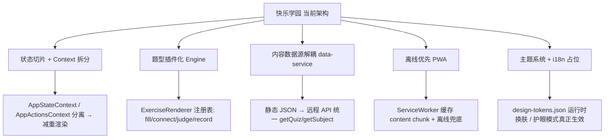

# 快乐学园（happy-learning）· 技术剖析报告

> 作者：高见远（架构师） ｜ 日期：2026-08-13 ｜ 方法：基于**真实代码**抽样 + 状态层全量通读
> 范围：`C:\Users\zhouqi\WorkBuddy\1\happy-learning`
> 配套文档：`docs/IMPROVEMENT-PLAN.md`、`docs/architecture/ARCH-REFACTOR-PLAN.md`（均为本人此前撰写的 Phase-1 方案，本次以"真实代码 vs 方案"为基线复核）

---

## 0. 关键结论速览：已知背景多处低估了项目成熟度

团队简报中的"已知背景"基本准确，但**严重低估了项目实际完成度**，且与 `README.md` 差异巨大。核心纠正如下：

| # | 简报/README 的认知 | 真实代码（证据） | 影响 |
|---|---|---|---|
| 1 | "状态管理为 Context + useReducer（集中式）"；问"单一巨型 reducer 是否臃肿" | reducer **已切片**：`src/state/reducer.ts` 组合 + `src/state/reducers/{progress,parent,rewards,review,profile}.ts` 五个 slice（`reducer.ts:9-40`） | 团队担心的"巨型 reducer"**已解决**，无需重构切片 |
| 2 | 技术栈 "JavaScript(JSX)" | **状态层已全量 TypeScript**：`src/state/*.ts`（types/reducer/storage/constants/helpers + reducers/*.ts）；组件仍为 JSX | 类型安全已在状态层落地，组件层仍需迁移 |
| 3 | 列举潜在新模块含"错题复习小程序、家长周报" | 二者**已交付并集成**：`src/components/modules/WrongQuestionCenter.jsx`、`ParentWeeklyReport.jsx` | 这两个**不是新模块**，本报告改为"现状评估" |
| 4 | README 描述 ~20 个源文件、单列 `data/content.js`、`state/AppContext.jsx` | 实际 **75 个源文件 / 7995 行**；`data/` 有 5 文件、`state/` 有 7 文件 + `reducers/` 5 文件 | README **严重过时**（见 §1.6） |
| 5 | README 称存储键 `happy-learning-state-v1`、语言"零 emoji" | 实际键 `happy-learning-state-v2`（`storage.ts:6`）；`MATCH_WORDS` 含 emoji 字面量（`content.js:454-460`） | README 两处描述与代码不符 |
| 6 | 未提及路由/分包 | `App.jsx:9-18` 已 `React.lazy` 9 个路由页；`vite.config.js` 已拆 `react-vendor` | 性能基线已优于简报假设 |

**派生数据（实测 `dist/assets`，2026-08-13 构建产物）：**
- 主 `index` chunk = **50.8 KB**（通过 <180KB 门禁）
- `react-vendor` = 163 KB（已拆出）｜`content` chunk = **110 KB**（含 `GRADE_LEARNING`）
- 页面分包：Home 11KB / GradeLearning 6.6KB / ParentCenter 16KB / PlayCenter 7KB / ReviewCenter 7KB / SubjectPage 4KB / TextbookPage 7.7KB / VideoLibrary 2.3KB / LearnCenter 1.9KB / GrowthCenter 11.7KB

---

## 1. 现有功能模块盘点

盘点口径：逐目录说明职责、关键文件、复杂度（行数）、是否数据驱动。行数来自 `wc -l`。

### 1.1 `src/state/`（状态层，已 TS 化）
| 模块/文件 | 职责 | 行数 | 数据驱动 | 备注 |
|---|---|---|---|---|
| `AppContext.jsx` | Provider：`useReducer` + `derived`(`useMemo`) + `actions`；`useApp()` | 171 | — | 单一 context 值 `{state, derived, actions}`（重渲染隐患见 §3.2） |
| `reducer.ts` | 组合 reducer，按动作域委派 slice | 40 | — | 已切片 |
| `reducers/progress.ts` | 课程/答题/视频/计时 | 164 | — | 含错题本写入、幂等保护 |
| `reducers/review.ts` | 间隔重复 SRS（Leitner box 推进）、清空错题 | 37 | — | `[1,3,7,7]` 天间隔（`review.ts:13`） |
| `reducers/rewards.ts` | 游戏加分、奖励兑换 | 37 | — | 幂等 |
| `reducers/parent.ts` | 家长设置/年级/未成年模式/密码 | 31 | — | `SET_GRADE` 校验 1–6 |
| `reducers/profile.ts` | HYDRATE（导入）、RESET | 19 | — | |
| `storage.ts` | `loadState/saveState/migrate(v1→v2)` | 164 | — | 防御式合并、版本迁移完备 |
| `types.ts` | `AppState`/`AppAction` 判别联合 + 子类型 | 97 | — | 类型安全核心 |
| `constants.ts` | `POINTS` 积分规则 | 9 | — | |
| `helpers.ts` | 纯函数：日期/连签/历史 | 65 | — | 与 `utils/date.js` 重复（§3.1） |
| `profileIO.js` | 档案导出/导入（JSON 快照） | 53 | — | 跨设备保全，纯函数 |

**评估**：状态层是项目最成熟的部分——切片 reducer、SRS、版本迁移、纯函数抽取均到位。

### 1.2 `src/data/`（数据层，与视图分离）
| 文件 | 职责 | 行数 | 数据驱动 | 备注 |
|---|---|---|---|---|
| `content.js` | 全部业务数据 + 纯函数（`SUBJECTS`/`QUIZZES`/`VIDEOS`/`REWARDS`/`GRADE_KNOWLEDGE`/`GRADE_LEARNING`/`NAV_ITEMS`/`getQuiz`/`getSubject`…） | **2145** | 是 | **单文件巨型数据块**；`GRADE_LEARNING` 约 1400 行（§3.2 性能） |
| `subjects.js` | `LESSONS`（含 `texts[].exercises` 五型）、`BADGES`、`LEVEL_*` | 424 | 是 | 从 content.js 拆出以减小主包 |
| `textbook.js` | 教材同步数据 | 65 | 是 | |
| `site.js` | 品牌/页脚常量 | 61 | 是 | 极小 |
| `fun.js` | 趣味文案/彩蛋（`PRAISE`/`ENCOURAGE`/`MASCOT_LINES`） | 61 | 是 | |

**评估**：数据驱动做得好（加学科/年级只需加数据）。但 `content.js` 是单文件 2145 行，编辑易错、PR 易冲突；`MATCH_WORDS` 含 emoji（§3.1）。

### 1.3 `src/components/ui/`（可复用原语）
`Button` / `ProgressBar` / `Pill` / `SubjectCard` / `SectionHeading` / `PageHeader` / `ErrorBoundary` / `Icon` / `VideoCard`（9 文件）。全部数据驱动（props 传入）。
- **`Icon.jsx`（204 行）**：全内联 SVG 图标集（~45 个），`name` 为键，无 emoji——这是落实"P0 emoji 禁令"的核心基础设施。
- **`ErrorBoundary.jsx`（131 行）**：class 组件，识别 `ChunkLoadError` 引导刷新、其他错误显示吉祥物兜底，设计令牌着色（**质量亮点**）。

### 1.4 `src/components/sections/`（首页业务区块）
`FinalCTA`/`SubjectModules`/`AnimatedVideos`/`Gamification`/`ProgressTracking`/`InteractiveExercises`/`AchievementWall`/`Hero`/`Footer`/`ResponsiveShowcase`/`ParentPanel`（11 文件）。均为数据驱动展示区块。
- **`ParentPanel.jsx`（347 行）**：最大组件，聚合档案/时长/护眼/未成年模式/密码/档案导入导出。含 `TYPE_ICON`（与 DailyCheckIn、ParentWeeklyReport 重复，§3.1）。

### 1.5 `src/components/pages/` + `modules/` + `fun/` + 顶层
| 分组 | 文件（行数） | 职责要点 | 数据驱动 |
|---|---|---|---|
| **pages（路由页）** | `Home`(52) `LearnCenter` `SubjectPage`(128) `TextbookPage`(223) `ReviewCenter` `GrowthCenter` `GradeLearning`(255) `PlayCenter` `ParentCenter` `VideoLibrary`(81) | 路由级页面，多数 `lazy` | 是 |
| **modules（功能模块）** | `GradeKnowledge`(133) `CollectionAlbum`(112) `WrongQuestionCenter`(106) `ParentWeeklyReport`(141) `DailyCheckIn`(182) `GameCenter`(128) `RewardStore`(81) `SubjectMastery`(77) `GradeLearning`(255) `LessonTexts`(121) | 独立功能积木 | 是 |
| **fun（趣味层）** | `FunContext`(85) `CelebrationLayer`(72) `Mascot`(71) `FunWatchers`(44) | `useFun()` API、庆祝/音效/吉祥物/彩蛋、副作用监听 | — |
| **顶层** | `ExerciseEngine`(211) `VideoModal`(93) `MinorModeGate`(104) `App`(66) `main`(26) | 答题引擎/视频弹窗/未成年夜间锁/路由装配/入口 | — |

**重点模块说明：**
- **`ExerciseEngine.jsx`（211 行）**：答题引擎，**仅支持单选**（`q.options`/`q.answer`/`q.explanation`，`ExerciseEngine.jsx:40-65`）。通过 `initialReview` 支持错题复习模式，复用 `useFun` 趣味反馈。
- **`GradeLearning.jsx`（255 行）**：年级分层学习，数据驱动读取 `GRADE_LEARNING`，四段式（解析/练习/误区/应用/螺旋）。内置 `ExerciseItem` 仅作"指导练习"（**不写全局状态**）。
- **`WrongQuestionCenter.jsx`（106 行）**：**已交付**。聚合各科错题，内嵌 `ExerciseEngine` 复习模式 + `recordReview` 推进 SRS。
- **`ParentWeeklyReport.jsx`（141 行）**：**已交付**。聚合近 7 天 `history`，可复制分享。
- **`FunWatchers.jsx`（44 行）**：**副作用隔离典范**——监听 `derived.level/badges/streak` 触发庆祝+音效，不改状态（架构亮点）。
- **`MinorModeGate.jsx`（104 行）**：未成年人 22:00–6:00 锁定 + 家长密码临时放行（合规）。
- **`GameCenter.jsx`**：记忆翻牌，用 `MATCH_WORDS` 的 **emoji 作功能图标**（`GameCenter.jsx:115` 渲染 `{c.emoji}`）——与 P0 emoji 禁令冲突（§3.1）。

### 1.6 README 结构描述 vs 实际（团队要求的"差异"核实）

`README.md` 描述的是一个**更早、更小的版本**，与 2026-08-13 代码严重不符：

| 维度 | README 描述 | 实际代码 | 证据 |
|---|---|---|---|
| 文件结构 | 树仅列 ~20 文件；`data/` 仅 `content.js`+`fun.js`；`state/` 仅 `AppContext.jsx` | 75 文件；`data/` 5 文件；`state/` 12 文件（含 `reducers/`） | `README.md:79-135` vs `Glob src/**` |
| 存储键 | `happy-learning-state-v1` | `happy-learning-state-v2`（v1 兼容回退） | `README.md:175` vs `storage.ts:6` |
| `parent` 字段 | `{dailyLimitMin, eyeRest, sound}` | 另含 `minorMode/parentPin/minorDailyCapMin` | `README.md:192` vs `types.ts:31-38` |
| actions | 仅列 7 个 | 实际 17 个（含 `setGrade/addPoints/redeemReward/recordReview/markTextRead/...`） | `README.md:197-205` vs `types.ts:80-97` |
| 语言/emoji | "JavaScript(JSX)"、"零 emoji" | 状态层 TS；`MATCH_WORDS` 含 emoji | `README.md:46,48` vs `state/*.ts`、`content.js:454` |
| 功能特性 | 未提及 年级分层/错题复习/家长周报/每日打卡/奖励商店/课文朗读背诵打卡/未成年模式/档案导入导出/SRS | 均已实现 | `README.md:9-19` vs `modules/` 实际 |
| 趣味层 API | `celebrate({title, emoji, ...})` | 实际为 `celebrate({title, icon, ...})`（无 `emoji` 键） | `README.md:27,257` vs `FunContext.jsx:24-39` |

> **结论**：README 与代码偏差属 P1（误导新成员/用户），建议本轮重写（见 §5、REFACTOR 文档 R10）。

---

## 2. 技术栈构成

### 2.1 依赖（`package.json`）
- **运行时**：`react@^18.3.1`、`react-dom@^18.3.1`、`react-router-dom@^6.30.4`（**已用路由**，简报未提）。
- **开发**：`vite@^5.4.10`、`@vitejs/plugin-react`、`typescript@^5.6.3`、`typescript-eslint@^8.13`、`eslint@^9.13`、`eslint-plugin-react-hooks`、`eslint-plugin-jsx-a11y`、`prettier`、`husky`、`lint-staged`。
- **scripts**：`dev/build/preview/lint/format/format:check/typecheck/prepare(husky)`。**无 `test` 脚本**（§2.5）。

### 2.2 构建（`vite.config.js`）
- `manualChunks`：仅把 `react/scheduler/history` 拆为 `react-vendor`（`vite.config.js:16-24`）。
- 路由级代码分割在 `App.jsx:9-18`（`React.lazy` 9 个页面 + `Suspense`）。
- 实测主 chunk 50.8KB（§0）。

### 2.3 语言与类型化
- **混合现状**：状态层 `.ts`（类型安全），组件层 `.jsx`（无类型）。
- `tsconfig.json`：`allowJs:true`、`checkJs:false`、`strict:false`、`noEmit:true`——**`typecheck`(`tsc --noEmit`) 仅校验 `.ts` 文件**，组件 JS 不参与类型检查。
- `src/vite-env.d.ts` 存在（TS 装配完整）。

### 2.4 代码规范与质量门禁
- **ESLint 9 Flat Config**（`eslint.config.js`）：`.jsx` 启用 `react-hooks`+`jsx-a11y`；`.ts/.tsx` 走 `typescript-eslint`；`prettier` 兼容置于末位。
  - **P0 emoji 禁令**：`no-restricted-syntax` 用 unicode 区间拦截 `JSXText`/`Literal` 中的 emoji（`eslint.config.js:48-58`）→ 与 `MATCH_WORDS` emoji 冲突（§3.1）。
- **Prettier**：`semi:false`、单引号、`printWidth:100`。
- **husky + lint-staged**：`.husky/pre-commit` 存在（运行 `lint-staged`：eslint --fix + prettier）。
- **设计令牌门禁**（`scripts/check-design-tokens.sh`）：
  - 非白名单 `src` 文件仅允许 `#fff/#000`，其余硬编码色一律失败；
  - `src/index.css` 豁免（令牌定义本身）；
  - 插画白名单 `docs/design/illustration-whitelist.json`；
  - **主 chunk < 180KB（184320B）体积断言**（防年级数据被拉回主包）。

### 2.5 测试现状
- **零自动化测试**：无 `vitest`/`jest`/`@testing-library` 依赖；无 `*.test.*`/`__tests__` 文件；`package.json` 无 `test` 脚本；CI 无测试步骤。
- 纯函数已抽出（`helpers/storage/reducers/slices`），具备可测性，**但无测试覆盖**（§3.3、REFACTOR R7）。

### 2.6 CI（`.github/workflows/ci.yml`）
- 触发：push `main` / PR。
- 步骤：`Setup Node 20 → npm ci → typecheck → lint → format:check → build → check-design-tokens.sh`。
- **缺失**：测试步骤（因无测试）；`ssr-check.mjs` 未在 CI 运行（仅本地诊断脚本）。

### 2.7 诊断脚本（`scripts/ssr-check.mjs`）
- 用 Vite SSR `renderToString` 遍历 9 条路由，捕获首屏渲染异常（"临时诊断脚本"）。**未接入 CI/package scripts**，属一次性验证工具，建议固化为 `npm run ssr-check` 或并入 CI。

---

## 3. 薄弱环节（按严重度，均附证据）

### 3.1 代码质量（P1–P2）

| 问题 | 证据（文件:行 + 片段） | 影响 | 修复指向 |
|---|---|---|---|
| **重复：`TYPE_ICON` 三处** | `ParentPanel.jsx:13`、`DailyCheckIn.jsx:14`、`ParentWeeklyReport.jsx:10` 各自定义 `{lesson,quiz,video,game}` 映射 | 改一处易漏，违反 DRY | 抽到 `src/state/constants.ts` 或 `src/data/*`（REFACTOR R3） |
| **重复：日期工具双份且型不同** | `utils/date.js`（`localDateStr` 返回 string）vs `state/helpers.ts:4`（`localDateStr` 返回 string）/`:17`(`addDays` 返回 Date)；`WrongQuestionCenter.jsx:11` 另写 `todayStr()` | 同名不同实现，维护混乱 | 统一到 `utils/date.ts`（R3） |
| **死功能：`eyeRest` 护眼提醒未接线** | 设置已持久化（`ParentPanel.jsx:48,248` `updateParent({eyeRest})`），但**全代码无消费方**（grep `eyeRest` 仅 4 处：默认/类型/定义/标题） | 合规缺口：《未保条例》要求"连续30分钟休息提醒"未实现；开关形同虚设 | 决策后补逻辑或下线开关（R4） |
| **emoji 门禁冲突** | `content.js:454-460` `MATCH_WORDS` 含 `☀️🌙⭐🍎📚🐱`；`GameCenter.jsx:115` 当功能图标渲染 `{c.emoji}`；但 `eslint.config.js:48-58` 禁 emoji | 若 CI 跑 `eslint`，此文件应报 P0 错误（**待核实**：本地 `node_modules/.bin/eslint` 未安装，无法现场验证） | 替换为 `Icon` 资源或加白名单/`eslint-disable`（R8） |
| **文案 bug** | `MinorModeGate.jsx:54` 中文串混入英文 `"22:00–6:00 为休息 time"`；`:18` 与 `:21` 重复注释 | 用户可见英文错词；低质 | 改正文案、删重注释 |
| **魔法数字** | `GameCenter.jsx:10` `const REWARD = 20`；`MinorModeGate` 硬编码 22/6；`storage.ts:11` `dailyLimitMin:30` | 散落难调 | 入 `constants.ts`（R3） |

### 3.2 性能（P0–P1）

| 问题 | 证据 | 影响 | 修复指向 |
|---|---|---|---|
| **首屏仍拉 110KB `content` chunk（含 `GRADE_LEARNING`）** | `dist/assets/content-B7vq59rE.js = 110KB`；`Home` 静态且经 `sections` 静态 `import` `content.js`（`App.jsx:9` Home 非 lazy），故 `content` chunk 随首屏加载 | 门禁只测 `index` chunk(50KB)→通过，但**总首屏 JS ≈ 50+163+110+… ≈ 330KB**，年级数据未真正按需。Phase-1 目标"年级数据仅 `/grade` 加载"**未达成** | `content.js` 拆分 + 年级数据独立 chunk 仅 `/grade` 引（R1） |
| **AppContext 单 context 值导致全量重渲染** | `AppContext.jsx:159` `value = useMemo(()=>({state,derived,actions}),[state,derived,actions])`；任意 `state` 变更 → `derived` 重算 → `value` 新引用 → 所有 `useApp()` 消费者重渲染 | 随功能增长，任一状态变化抖动放大 | 拆 `AppStateContext`/`AppActionsContext`；`useApp` 兼容层（R2，对应 IMPROVEMENT-PLAN §4.2） |
| **`derived` 每次全量重算** | `AppContext.jsx:30-123` 含 badges O(n)/mastery 3 科/年级进度遍历 | 当前规模可接受；数据增长成热点 | 抽 `selectors` 层 + 按需 `useMemo`（R2 附带） |

### 3.3 架构（P0–P2）

| 问题 | 证据 | 影响 | 修复指向 |
|---|---|---|---|
| **题型系统不统一（插件化缺口）** | `ExerciseEngine.jsx:14-65` 仅单选；`LESSONS[].texts[].exercises` 支持 `read/recite/think/fill/connect` 五型，但 `LessonTexts.jsx:15-81` 仅作"揭示答案"展示、**不入库不计分**；`getQuiz`(`content.js:384-397`) 把 `GRADE_LEARNING` 练习并入单选题库 | 两套并行练习体系；新增自动判分题型（连线/拖拽/听读）需深改 `ExerciseEngine` | 题型渲染器注册表（R6 + 新模块"AI 口语"） |
| **`content.js` 单文件 2145 行** | `wc -l content.js = 2145`；`GRADE_LEARNING` 约 1400 行 | 编辑易错、PR 冲突、首屏体积（§3.2） | 拆 9 文件 + `data/grade/g1..g6`（R1，§4.3 已规划） |
| **可测试性具备但零测试** | 纯函数已抽（`helpers/storage/reducers`），但无测试（§2.5） | 回归风险随功能增长上升 | Vitest 补 ~15 例（R7） |
| **错误边界仅最外层** | `main.jsx:15` 单 `ErrorBoundary` 包 `HashRouter`；`App.jsx:35` `Suspense` 无每路由 `ErrorBoundary` | 单页 chunk 崩溃会拖垮整段路由区 | 每路由 `Suspense` 内加 `ErrorBoundary`（R5，§4.6） |
| **缺 `selectors`/`data` 子目录分层** | `derived` 内联 `AppContext`；`data` 平铺 | 长文件、耦合略高 | 抽 `selectors.ts`、`data/static|api`（R1/R9） |

**已做对的（勿过度重构）**：状态切片 reducer、SRS 复习、版本迁移、趣味层副作用隔离（`FunWatchers`）、错误边界 chunk 识别、设计令牌门禁、路由懒加载——这些 Phase-1 目标**已落地**，不应重复建设。

---

## 4. 可扩展方向（5 个）

1. **状态切片 + Context 拆分**（架构）：拆 `AppStateContext`/`AppActionsContext`，`actions` 稳定引用使仅消费动作的组件免重渲染（直接命中 §3.2 性能问题）。
2. **题型插件化**（扩展性）：`ExerciseEngine` 抽象为"题型渲染器注册表"，新增题型只需注册渲染器+判分器，不改引擎主流程（命中 §3.3 题型缺口）。
3. **内容数据源解耦**（多端/后端）：在现有 `getSubject/getQuiz/...` 接口之上加 data-service 层，底层从静态 import 渐变为 `fetch(JSON)`/远程 API；同时解决首屏全量加载（详见 REFACTOR 文档"新模块 3"）。
4. **离线优先 PWA**（弱网/离线）：Service Worker 预缓存应用壳 + 运行时缓存 `content` chunk，离线可用（详见"新模块 1"）。
5. **主题系统 + i18n 占位**（个性化/合规）：`design-tokens.json` 已就绪，可做运行时换肤与"护眼模式"真正生效；i18n 为未来多语言占位（小学生场景优先级低）。

---

## 5. 待明确事项清单（需用户/产品决策）

| # | 待决事项 | 为什么需要决策 | 建议默认 |
|---|---|---|---|
| Q1 | 是否继续**全量 TS 化**（组件 JSX→TSX）？本期范围/排期？ | 当前仅状态层 TS，组件无类型；迁移有成本 | 采用棘轮策略分步迁移（R9），不一次性改名 |
| Q2 | `eyeRest` 护眼提醒**做不做**？（合规《未保条例》要求 30 分钟提醒） | 开关已持久化但无逻辑；属合规项 | 做：补 `setInterval` 提醒（受 `eyeRest`+`sound` 控制） |
| Q3 | 题型扩展优先级：是否扩到 6 型（识字/笔顺/听读）？ | 影响 Engine 重构范围 | 先落"题型插件化"骨架，按内容路线图逐步扩 |
| Q4 | 是否引入**后端/账号**？ | 已知边界：localStorage 不可做多端同步/防篡改/找回 | 本期仍纯前端 + localStorage（IMPROVEMENT-PLAN §4.7） |
| Q5 | **AI 口语陪练**：自研 Web Speech 还是接后端 LLM？录音如何合规存储？ | 决定实现复杂度与数据合规 | 先 Web Speech 自评 + 录音回放（不假装 AI 打分），预留后端 seam |
| Q6 | 测试策略：是否补 **Vitest** 测纯函数？ | 零测试，回归风险 | 补 ~15 例覆盖 slices/selectors/date |
| Q7 | **README 是否重写**对齐现状？ | 文档严重过时（§1.6） | 是，本轮重写 |
| Q8 | `MATCH_WORDS` emoji：保留（加白名单/禁用规则）还是替换为 `Icon` 资源？ | 与 P0 emoji 门禁冲突 | 替换为 `Icon`（太阳/月亮/星星/苹果/书/猫） |

---

## 6. 工作量与优先级总览

| 议题 | 优先级 | 估时 | 类型 |
|---|---|---|---|
| R1 `content.js` 拆分 + 年级数据按需加载 | **P0** | M（3–4 人日） | 重构/性能 |
| R2 AppContext 拆分（减重渲染） | **P0** | M（2–3 人日） | 重构/性能 |
| R3 纯函数去重归口（TYPE_ICON/日期/REWARD） | P1 | S（1 人日） | 质量 |
| R4 eyeRest 接线 / 下线（依赖 Q2） | P1 | S（0.5–1 人日） | 合规 |
| R5 每路由 ErrorBoundary 隔离 | P1 | S（0.5 人日） | 健壮 |
| R6 题型插件化骨架 | P1 | M（2–3 人日） | 架构 |
| R7 Vitest 测试补齐 | P1 | S–M（1–2 人日） | 质量 |
| R8 emoji 门禁一致性（MATCH_WORDS） | P1 | S（0.5 人日） | 质量 |
| R9 TS 迁移策略（棘轮） | P2 | L（持续） | 质量 |
| R10 README 重写对齐 | P2 | S（0.5 人日） | 文档 |
| 新模块1 离线 PWA | P1 | M（2–3 人日） | 新功能 |
| 新模块2 AI 口语陪练（占位） | P2 | M（2–3 人日） | 新功能 |
| 新模块3 内容数据源解耦 | P1 | M–L（3–5 人日） | 新功能/架构 |

> 估时基准：S≈0.5–1 人日，M≈2–4 人日，L≈5+ 人日。详细拆解见 `REFACTOR-AND-NEW-MODULES.md`。
