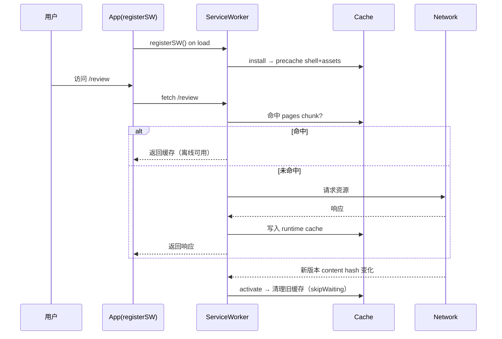
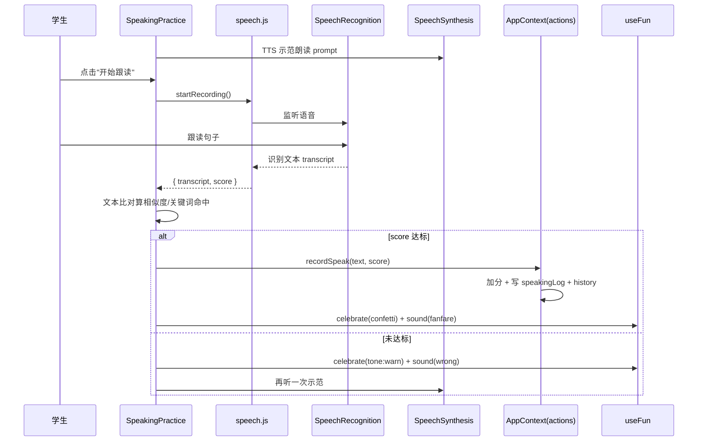
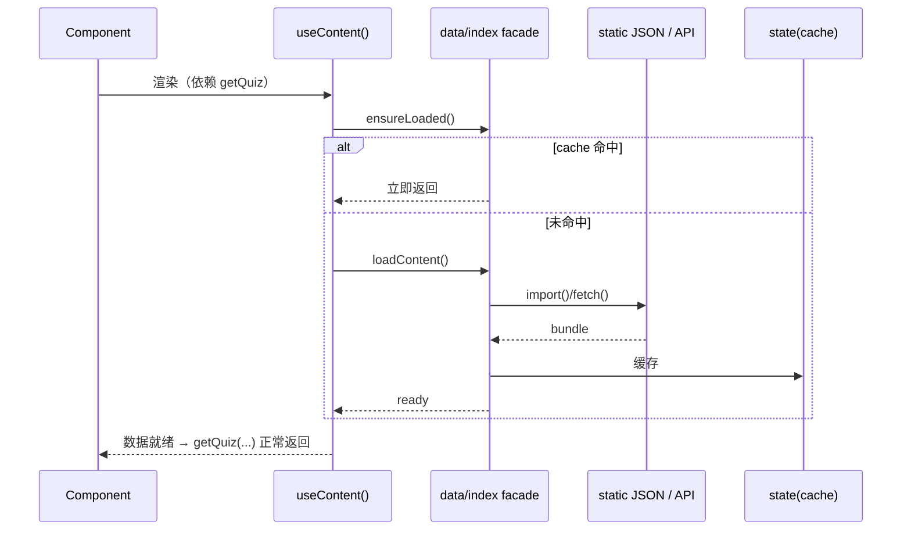
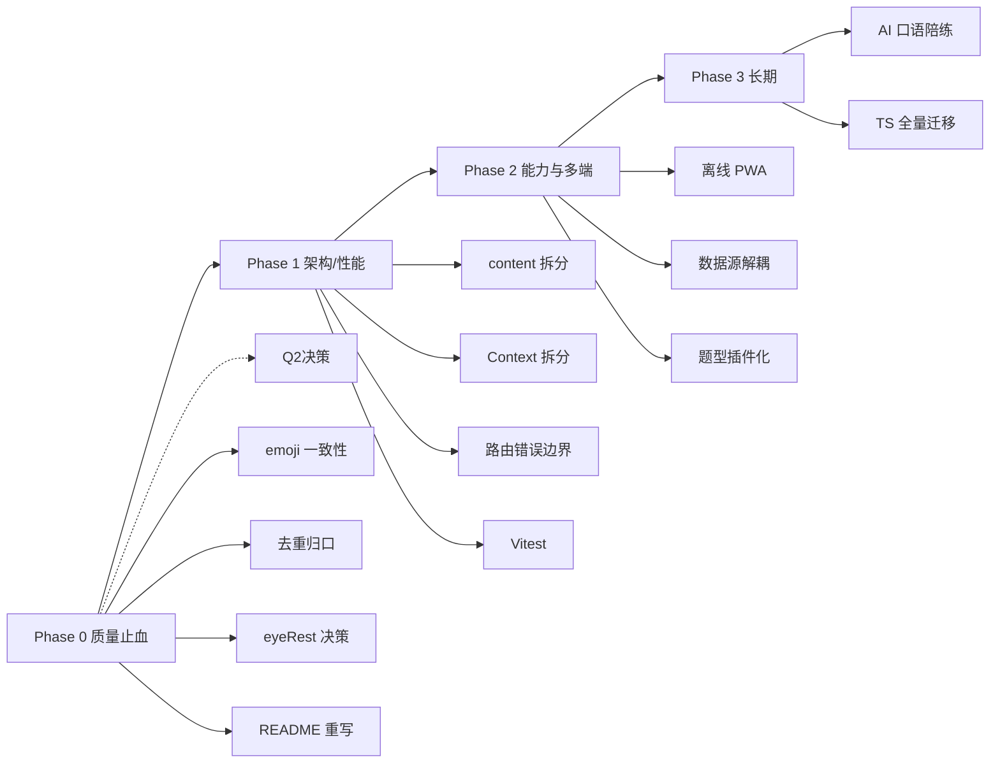

# 快乐学园（happy-learning）· 重构方案与新功能模块实现规划

> 作者：高见远（架构师） ｜ 日期：2026-08-13
> 配套：`docs/architecture/PROJECT-ANALYSIS.md`（全面剖析）、`docs/IMPROVEMENT-PLAN.md`（Phase-1 方案）
> 原则：**基于真实代码、可执行、低风险**；优先复用已落地的状态切片/趣味层/门禁，避免重复建设。

---

## A. 代码重构改进方案

每项结构：**当前问题 → 目标 → 具体改法（文件/模式）→ 预期收益 → 风险**。优先级与估时见文末总表。

### R1. `content.js` 拆分 + 年级数据按需加载  ⭐P0
- **当前问题**：`src/data/content.js` 单文件 **2145 行**（`GRADE_LEARNING` 约 1400 行），被 `Home`→`sections` 静态 `import`，导致 `dist/assets/content-*.js = 110KB` **随首屏加载**；门禁只测 `index` chunk(50KB) 通过，但年级数据未真正按需（PROJECT-ANALYSIS §3.2）。
- **目标**：首页首屏不再加载年级数据；`/grade` 才按需拉取。
- **具体改法**：
  - 按域拆 9 文件：`data/subjects.ts`(已拆)、`data/quizzes.ts`、`data/videos.ts`、`data/rewards.ts`、`data/badges.ts`、`data/nav.ts`、`data/grade/knowledge.ts`、`data/grade/learning.ts` + `data/grade/g1..g6.ts`；`BADGES.check` 含函数，**保留 `.ts`**。
  - 新增 `data/index.ts` 作为 facade，暴露 `getSubject/getQuiz/getLessons/...`（签名不变）。
  - ⚠️ `data/index.ts` **绝不可静态 `export *` 年级数据**（否则 Rollup 拉回主包）。
  - `GradeLearning`/`GradeKnowledge` 改为**动态 `import()`** 年级数据（或在 facade 内用 `import()` 懒取）。
  - 同步保留 `scripts/check-design-tokens.sh` 的主包 <180KB 断言 + 新增"年级 chunk 不进主包"断言。
- **预期收益**：首屏 `content` chunk 由 110KB 降至 ~10KB（科目/题库基础），年级数据仅 `/grade` 加载；编辑冲突大幅下降。
- **风险**：import 路径调整面广（≈15 处调用方）；回归测试需覆盖 `getQuiz(subjectId, grade)` 合并逻辑。

### R2. AppContext 拆分（状态/动作分离，减少重渲染）  ⭐P0
- **当前问题**：`AppContext.jsx:159` 单一 `value={state, derived, actions}`，任意 `state` 变更都重建 `value` 引用 → 所有 `useApp()` 消费者重渲染（§3.2）。
- **目标**：仅消费 `actions` 的组件（如 `FunWatchers`、纯按钮）不因 `state` 变化重渲染。
- **具体改法**：
  - 拆为 `AppStateContext`（`{state, derived}`）+ `AppActionsContext`（`actions` 稳定引用）。
  - `actions` 已 `useMemo([])` 稳定（`AppContext.jsx:126-157`），直接独立 Provider。
  - 保留 `useApp()` 兼容层（一次性返回两者），**不破坏 40+ 调用点**；新增 `useAppState()`/`useAppActions()` 渐进迁移。
  - 抽 `derived` 计算到 `src/state/selectors.ts`（纯函数），便于测试与按需 memo。
- **预期收益**：高频交互（答题、游戏）不再引发无关组件重渲染；为大数据量铺路。
- **风险**：低。`useApp` 兼容层兜底，调用点零改动即可先受益（仅状态消费者仍重渲染，动作消费者立即免渲染）。

### R3. 纯函数去重与归口  ⭐P1
- **当前问题**：`TYPE_ICON` 在 `ParentPanel:13`/`DailyCheckIn:14`/`ParentWeeklyReport:10` 三处重复；日期工具 `utils/date.js` 与 `state/helpers.ts` 双份且 `addDays` 返回型不同；`GameCenter:10` `REWARD=20` 魔法数字。
- **目标**：单一事实来源，消除 DRY 违规。
- **具体改法**：
  - `TYPE_ICON`/`TYPE_LABEL` 抽到 `src/state/constants.ts`（或 `src/data/historyIcons.ts`）。
  - 日期工具统一到 `src/utils/date.ts`（`state/helpers.ts` 的 `localDateStr/yesterdayStr/addDays` 改为 re-export 或删除；`WrongQuestionCenter.todayStr` 改用 `localDateStr`）。
  - `REWARD` 等游戏积分入 `constants.ts`（`POINTS` 旁）。
- **预期收益**：一致性提升，改动扩散风险降低。
- **风险**：低（纯搬运 + 引用替换）。

### R4. `eyeRest` 护眼提醒接线 / 下线  ⭐P1（依赖 Q2）
- **当前问题**：`eyeRest` 已在 `ParentPanel:48,248` 持久化，但全代码无消费方 → 合规要求的"连续 30 分钟休息提醒"未实现（§3.1）。
- **目标**：要么真正生效，要么下线开关，消除"假功能"。
- **具体改法**（若决策"做"）：
  - 新增 `src/components/MinorModeGate` 同级 `EyeRestWatcher` 或在 `FunWatchers` 内加 `useEffect`：累计 `studySeconds` 每自然日，达 `parent.dailyLimitMin`? 不——护眼应为 **20/30 分钟连续用眼提醒**（非每日上限）。建议：监听 `recordStudy`/答题/视频累计，满阈值弹非阻塞提醒 toast（受 `eyeRest`+`sound` 控制），每日至多提醒 N 次。
  - 触发走 `useFun().celebrate({icon:'moon', tone:'warn'})`。
- **预期收益**：满足《未成年人网络保护条例》"连续使用提醒"合规项；开关名副其实。
- **风险**：中。提醒节奏/频次需产品定义，避免骚扰。

### R5. 每路由 ErrorBoundary 隔离  ⭐P1
- **当前问题**：仅 `main.jsx:15` 最外层一个 `ErrorBoundary`；`App.jsx:35` `Suspense` 无每路由边界（§3.3）。
- **目标**：单页 chunk 崩溃只影响该路由，不拖垮全局。
- **具体改法**：在 `App.jsx` 每个 `<Route>` 的 `element` 外包 `<ErrorBoundary>`（或抽 `<RouteBoundary>` 复用 `ui/ErrorBoundary`）。保留外层兜底。
- **预期收益**：懒加载后单页错误隔离，用户体验更稳。
- **风险**：低。

### R6. 题型插件化骨架  ⭐P1
- **当前问题**：`ExerciseEngine` 仅单选；`LESSONS.texts` 五型仅"揭示答案"展示不入库（§3.3）。新增自动判分题型需深改引擎。
- **目标**：题型可注册扩展，引擎主流程稳定。
- **具体改法**：
  - 定义 `ExerciseType` 接口：`{ render(props), grade(answer, correct): boolean, toState? }`。
  - `ExerciseEngine` 改为遍历"渲染器注册表"`const renderers = { single, connect, fill, judge, record }`。
  - `submit()` 统一收集各题 `grade()` 结果 → `actions.answerQuiz(...)`。
  - 先落地 `single`（现有逻辑迁移）+ `connect`（连线，本地判定），为"AI 口语（录音判分）"预留 `record` 槽位（见新模块 2）。
- **预期收益**：内容路线图 P0"题型 1→6"可在不碰引擎主流程下推进。
- **风险**：中。需保证现有单选体验与错题本/积分逻辑不变（回归用例覆盖）。

### R7. Vitest 测试补齐  ⭐P1
- **当前问题**：零测试（§2.5），纯函数已具备可测性。
- **目标**：核心纯逻辑有回归保护。
- **具体改法**：`npm i -D vitest`；新增 `src/state/__tests__/`：
  - `progressReducer`：幂等（重复完成不加分）、错题本增删、积分累加。
  - `reviewReducer`：Leitner box 推进（全对+1、答错归零、间隔天数）。
  - `storage.migrate`：v1→v2 字段兜底、坏数据回退默认。
  - `helpers`：`bumpStreak`（今天/昨天/更早）、`addTodayStudy` 跨天清零、`localDateStr` 时区。
  - ~15 例，约覆盖 Phase-1 计划 §4.5 建议项。
- **预期收益**：重构（R1/R2/R6）有安全网。
- **风险**：低。

### R8. emoji 门禁一致性  ⭐P1
- **当前问题**：`MATCH_WORDS`（`content.js:454-460`）含 emoji，被 `GameCenter:115` 当功能图标；与 `eslint.config.js:48-58` P0 emoji 禁滥用职权（§3.1）。本地 `eslint` 未安装，**CI 是否因此报错待核实**。
- **目标**：消除门禁冲突，保持"零 emoji 功能图标"一致性。
- **具体改法（推荐）**：`MATCH_WORDS` 的 `emoji` 字段改为 `icon` 键（引用 `Icon` 已支持：`sun/moon/star/apple?/book/cat?`——缺的苹果/猫需补 SVG），`GameCenter` 渲染 `<Icon name={c.icon}/>` 替代 `{c.emoji}`。
- **预期收益**：通过 P0 门禁，视觉统一。
- **风险**：低。需补 1–2 个 Icon SVG（苹果/猫）。备选：若坚持用 emoji，则在 `eslint.config` 对该数据文件加 `eslint-disable` + `illustration-whitelist` 豁免（不推荐，削弱门禁意义）。

### R9. TS 迁移策略（棘轮）  ⭐P2
- **当前问题**：组件层 `.jsx` 无类型；`tsconfig` `checkJs:false/strict:false`。
- **目标**：渐进全量 TS 化，每步可构建。
- **具体改法**（IMPORVEMENT-PLAN §4.1）：叶子优先 `utils→data→state(已完成)→ui→sections/modules/pages→App/main`；严格度棘轮 `noImplicitAny→strictNullChecks→strictFunctionTypes→strict`；逃逸仅用 `@ts-expect-error`，禁 `any`。
- **预期收益**：组件层类型安全，减少运行期 bug。
- **风险**：中。组件多，需分批；严格度提高会暴露隐藏问题。

### R10. README 重写对齐现状  ⭐P2
- **当前问题**：README 描述更早版本，与代码偏差大（§1.6）。
- **目标**：文档即现状。
- **具体改法**：以 `PROJECT-ANALYSIS.md` §1 模块清单 + 真实 `state` 字段/actions 重写结构树、特性、状态管理章节；修正存储键 `v2`、补全 10+ 功能、修正 `celebrate({icon})` API、删除"零 emoji"表述（或说明 UI 零 emoji、数据层例外）。
- **预期收益**：降低新成员上手成本，对外表述准确。
- **风险**：低。

---

## B. 新功能模块详细实现规划

> **重要更正**：团队简报将"错题复习小程序、家长周报"列为潜在新模块——**二者已在代码中交付并集成**（`WrongQuestionCenter.jsx`、`ParentWeeklyReport.jsx`），本报告不再当作新模块，仅作现状评估（见 B.0）。以下为 **3 个真正新增**的高价值模块。

### B.0 已交付模块现状评估（非新模块）
| 模块 | 文件 | 集成度 | 评估 |
|---|---|---|---|
| 错题复习中心 | `modules/WrongQuestionCenter.jsx`(106) | 高：内嵌 `ExerciseEngine(initialReview)` + `recordReview` 推进 SRS + `clearWrong` | 完整可用；缺"按知识点溯源"展示（数据已有 `wrongEntries` 溯源字段，可增强） |
| 家长周报 | `modules/ParentWeeklyReport.jsx`(141) | 高：聚合 7 天 `history` + 复制分享 | 完整；可增强为"可打印 PDF/图片"（见开放问题） |

### B.1 新模块 1：离线优先 PWA（Service Worker + Manifest）  ⭐P1

**目标与用户价值**：小学生常在通勤/网络不稳环境使用；离线可打开已访问页面、继续复习，避免"白屏/加载失败"。与现有 `profileIO` 导出（跨设备保全）互补，构成"本地优先"双保险。

**数据模型**：
- **不新增 localStorage 字段**（沿用现有 `happy-learning-state-v2`）。
- Service Worker 缓存策略：
  - **precache**：应用壳（`index.html` + `react-vendor` + `index` chunk + `index.css` + `manifest` + 图标）。
  - **runtime cache**：`content` chunk、`pages/*` chunk（stale-while-revalidate）；`public/star.svg` 等静态资源。
  - **offline fallback**：未缓存路由 → 预渲染的 `offline.html`。

**关键文件与组件设计（相对路径）**：
```
public/manifest.webmanifest            # name/icons/start_url/display:standalone
public/icons/icon-192.png             # 必需 PWA 图标（新增资源）
public/offline.html                   # 离线兜底页
src/pwa/registerSW.js                 # 注册 SW（生产环境，dev 跳过）
src/pwa/sw.js                         # 自建 SW（或改用 vite-plugin-pwa 生成）
vite.config.js                        # 接入 vite-plugin-pwa（推荐）或手写配置
src/main.jsx                          # 调用 registerSW()
```
> 推荐 `vite-plugin-pwa`（基于 Workbox），避免手搓 SW 的缓存失效坑。

**与现有架构集成点**：
- 缓存 `content` chunk 即缓存全部题库/课文（离线可复习）。
- 状态读写仍走 `AppContext`↔`localStorage`，SW 不参与业务状态。
- 与 `profileIO.exportProfile` 共同覆盖"离线可用 + 跨设备保全"。

**调用流程（Mermaid 时序）**：


**依赖与开放问题**：
- 依赖：`vite-plugin-pwa`（或自建 SW）。
- 开放问题：① iOS Safari 对 PWA/ServiceWorker 支持有限（尤其离线 cache 行为），需在真机验证；② 缓存失效策略（新版本 `content` chunk hash 变化须触发 `activate` 清理旧缓存）；③ 是否要"可安装"提示 UI（受 `beforeinstallprompt` 控制）。

---

### B.2 新模块 2：AI 口语陪练（可插拔占位 + Web Speech API 自评）  ⭐P2

**目标与用户价值**：填补英语"开口说"缺口——现有英语仅单词/选择。对齐 IMPROVEMENT-PLAN §3.2"英语语音降级为自评+录音回放，不假装 AI 打分"。用浏览器原生 `SpeechRecognition`+`SpeechSynthesis` 实现**示范→跟读→识别→即时反馈**，无需后端即可跑；同时预留后端 LLM 评分 seam。

**数据模型（state 字段 + localStorage）**：
```ts
// 建议新增到 AppState（types.ts）：
speakingLog: Array<{ ts: number; text: string; score: number; lang: 'en' }>
// 录音 Blob 不存 localStorage（体积/合规）；仅存练习记录。
// 复用现有：points 积分、history 动态（type:'speak'）。
```
- localStorage 结构沿用 `happy-learning-state-v2`，新增 `speakingLog` 数组（`storage.ts` 的 `defaultState`/`migrate` 加字段兜底）。

**关键文件与组件设计（相对路径）**：
```
src/utils/speech.js                 # 封装 SpeechRecognition + SpeechSynthesis，带能力检测与降级
src/data/speakingPrompts.js        # 跟读语料（句子/单词，可分级）
src/components/modules/SpeakingPractice.jsx   # 主组件（选句→TTS 示范→录音→反馈+积分）
src/components/modules/SpeakingPractice.module.css
src/state/reducers/progress.ts     # 新增 RECORD_SPEAK action（写 speakingLog + 积分，幂等）
```
- `scoringProvider` 接口预留：`interface ScoringProvider { score(audio, text): Promise<number> }`；默认 `WebSpeechScoring`（本地识别文本比对），未来可换 `BackendLLMScoring`。

**与现有 AppContext/actions/derived 集成点**：
- 动作：新增 `actions.recordSpeak(text, score)` → `RECORD_SPEAK`（在 `progressReducer` 加 case，复用 `pushHistory`/`safeInt`/`bumpStreak`）。
- 趣味：复用 `useFun().celebrate/sound/setMood`（读对撒花、错安慰）。
- 派生：可在 `derived` 增 `speakingCount`（可选）。
- `FunWatchers` 可扩展监听 `derived.speakingCount` 解锁"口语小达人"徽章（`BADGES` 加一条）。

**调用流程（Mermaid 时序）**：


**依赖与开放问题**：
- 依赖：浏览器原生 Web Speech API（**Chrome/Edge 支持好，Safari 部分支持，需能力检测降级**）。
- 开放问题（需产品/合规决策）：① 录音是否上传后端做 AI 评分？若否，仅本地识别+回放（合规最稳）；② 儿童语音识别准确率偏低，反馈文案需宽容；③ "AI"定位边界——明确"自评"而非"AI 打分"，避免误导（呼应 IMPROVEMENT-PLAN §3.2）；④ 后端评分 seam 的接口与鉴权。

---

### B.3 新模块 3：内容数据源解耦（Backend-ready Data Service）  ⭐P1

**目标与用户价值**：`content.js` 2145 行静态数据（§3.2/§3.3）既是首屏体积根源，也阻碍"内容可运营"。抽一层 **data-service facade**，底层从静态 import 渐变为 `fetch(JSON)`/远程 API，前端调用方零改（统一 `getSubject/getQuiz/getLessons/...` 接口）。本期可仅做"静态 JSON 动态加载"（立即收益：按需加载），为未来后端/CMS 铺路。

**数据模型（state 字段 + localStorage）**：
- **不新增业务 state 字段**（数据仍在 `content` 语义内）。
- 引入加载态：`src/state/useContent.ts` 管理 `status: 'loading'|'ready'|'error'`，组件读取 facade 时触发。
- 远程模式（未来）：数据以 JSON 托管（CMS/API），带 `schema` 版本，`migrate` 逻辑上移到数据层。

**关键文件与组件设计（相对路径）**：
```
src/data/index.ts          # facade：对外唯一入口，保持现有 get* 签名
src/data/static/*.ts       # 现有数据迁移至此（同 R1 拆分）
src/data/api.ts            # fetch 远程/本地 JSON（可选，远程模式）
src/state/useContent.ts    # Hook：封装加载态 + 缓存 + 错误兜底
src/components/...         # 现有调用方改为消费 facade（签名不变，几乎零改）
```
- facade 伪代码：
```ts
// src/data/index.ts
let cache: ContentBundle | null = null
export async function loadContent(): Promise<ContentBundle> {
  if (cache) return cache
  // 本期：动态 import 静态 JSON；未来：return fetch(API).then(r=>r.json())
  cache = await import('./static/bundle')
  return cache
}
// getSubject/getQuiz 改为同步读 cache（useContent 保障就绪）
```

**与现有 AppContext/actions/derived 集成点**：
- `AppContext.derived` **不变**（数据格式与现有 `SUBJECTS/QUIZZES/GRADE_LEARNING` 一致）。
- 调用方（`ExerciseEngine`/`GradeLearning`/`SubjectPage`/`LearnCenter` 等）改为先 `useContent()` 确保就绪，再调用 `get*`（签名不变，改动极小）。
- 与 R1 协同：年级数据经 facade 动态加载，**首屏不再包含 `GRADE_LEARNING`**。

**调用流程（Mermaid 时序）**：


**依赖与开放问题**：
- 依赖：无新增运行时依赖（纯重构 + 可选 `fetch`）。
- 开放问题：① 本期是否接后端？若否，仅做 facade + 动态 import（收益=按需加载+未来可换源）；② 数据版本/迁移策略上移到数据层；③ CMS 选型（若运营内容）；④ 加载态 UI（骨架屏，呼应 ErrorBoundary 的 CLS 关注）。

---

## C. 工作量与优先级总览（重构 + 新模块）

| 编号 | 项 | 优先级 | 估时 | 类别 |
|---|---|---|---|---|
| R1 | content.js 拆分 + 年级按需加载 | **P0** | M | 重构/性能 |
| R2 | AppContext 拆分（减重渲染） | **P0** | M | 重构/性能 |
| R3 | 纯函数去重归口 | P1 | S | 质量 |
| R4 | eyeRest 接线/下线（依赖 Q2） | P1 | S | 合规 |
| R5 | 每路由 ErrorBoundary | P1 | S | 健壮 |
| R6 | 题型插件化骨架 | P1 | M | 架构 |
| R7 | Vitest 测试补齐 | P1 | S–M | 质量 |
| R8 | emoji 门禁一致性 | P1 | S | 质量 |
| R9 | TS 迁移（棘轮） | P2 | L | 质量 |
| R10 | README 重写 | P2 | S | 文档 |
| N1 | 离线 PWA | P1 | M | 新功能 |
| N2 | AI 口语陪练（占位） | P2 | M | 新功能 |
| N3 | 内容数据源解耦 | **P1** | M–L | 新功能/架构 |

> 估时：S≈0.5–1 人日，M≈2–4 人日，L≈5+ 人日。

---

## D. 建议落地顺序（分阶段，风险递减）



- **Phase 0（质量止血，约 2–3 人日）**：R8/R3/R4(决策后)/R10 + 明确 Q1–Q8。低风险、立刻提升门禁健康度与文档可信度。
- **Phase 1（架构/性能，约 6–8 人日）**：R1 + R2（最大收益：首屏 -100KB、减重渲染）+ R5 + R7（为重构兜底测试）。**这是投入产出比最高的阶段**。
- **Phase 2（能力/多端，约 6–9 人日）**：N1(离线 PWA) + N3(数据源解耦，可与 R1 合并实施) + R6(题型插件化骨架)。
- **Phase 3（长期）**：N2(AI 口语，依赖 Web Speech 验证/后端决策) + R9(TS 全量迁移)。

> **最高优先级 3 项**：① R1 content 拆分（性能+可维护性双收益）② R2 Context 拆分（性能）③ N3/R1 协同的数据源解耦（可运营+按需加载）。三者可合并为一轮"数据层与状态层现代化"，约 1.5–2 周。
